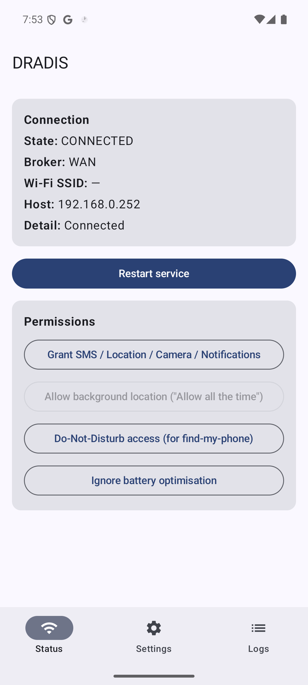
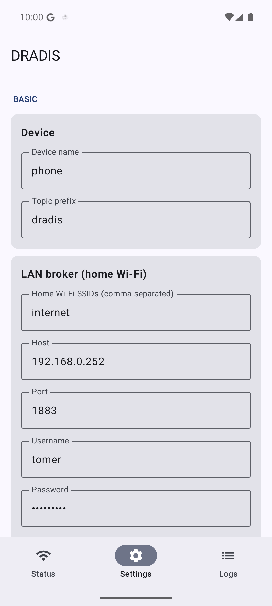
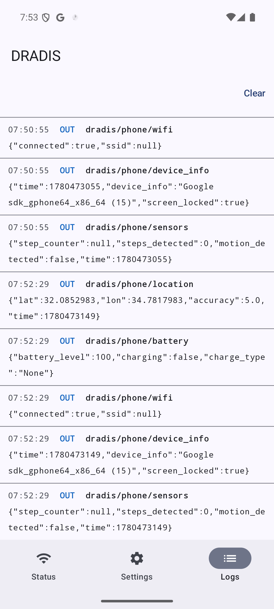

# DRADIS

**DRADIS** turns an Android phone into a remotely controllable MQTT endpoint. It
maintains a persistent MQTT connection from a foreground service and reacts to
inbound command topics — send SMS, get location, find-my-phone, take photo —
while publishing telemetry (battery, charging state, location, online status).

It is a native replacement for the third-party "Zanzito" app. The topic prefix
is configurable and defaults to `dradis`; set it to `zanzito` to stay
**wire-compatible** with the legacy backend (Mosquitto broker + a Flask
`smssender.py` microservice publishing to `zanzito/<device>/sendsms/...`).

A defining feature: DRADIS **picks one of two brokers based on the Wi-Fi network**
— a LAN broker when on a known home SSID, and a WAN broker otherwise — and
reconnects automatically as the phone moves between networks.

> Personal, sideloaded app. `SEND_SMS` and background location are heavily
> restricted on Google Play, so this is **not** intended for Play distribution.

---

## Screenshots

### Status
Live connection state, broker (LAN/WAN), current SSID/host, and one-tap access to
every permission DRADIS needs.



### Settings
Grouped into Basic, Update modes, Outbound and Inbound sections: device name,
topic prefix, home SSIDs, both brokers (host/port/auth/TLS), the update
interval, and each feature with its own options (SMS notify-on-send, location
high-accuracy, camera default, alarm duration + DND override, notification
read-aloud, TTS). Credentials are masked.



### Logs
A live mirror of inbound/outbound MQTT activity, independent of logcat.



---

## Features

| Feature | Description |
|---|---|
| Dual MQTT brokers | LAN broker on a home SSID, WAN broker otherwise; auto-reconnect on network change. |
| Send SMS | JSON `{phone,text}` or the legacy Zanzito topic-path form. |
| Location | On-demand fix, plus periodic publishing on the update interval. |
| Find my phone | Loud alarm that bypasses silent / Do-Not-Disturb. |
| Charging + battery | Charge type (AC/USB/Wireless/None), charging flag, battery %. |
| Take photo | Front or rear still, resized/compressed, published as base64 JPEG. |
| Push notification | Show a notification on the device's shade from a remote message. |
| Sensors | Publish step counter, step detector and significant-motion data. |
| Text-to-speech | Speak a remote message aloud on the device. |
| Telemetry | Battery, Wi-Fi and device info on separate topics; on connect, on change, on demand, and on the update interval. |

## Tech stack

Kotlin · Jetpack Compose + Material 3 · HiveMQ MQTT Client (3.1.1) · CameraX ·
FusedLocationProvider · DataStore · kotlinx.serialization · foreground service.
Min SDK 26, target/compile SDK 35, JDK 17, AGP 8.7.3 / Gradle 8.13.

---

## MQTT topic contract

Base segment is the configurable device name (default prefix `dradis`). QoS 1;
`status`/`version` are retained.

### Inbound (subscribed)

| Purpose | Topic | Payload |
|---|---|---|
| Send SMS (preferred) | `dradis/<device>/sendsms` | `{"phone":"+972...","text":"hello"}` |
| Send SMS (legacy) | `dradis/<device>/sendsms/<phone>` | raw string = message text |
| Get location now | `dradis/<device>/getlocation` | empty / `{}` |
| Find phone | `dradis/<device>/ping` | optional `{"seconds":30}` (`0` stops) |
| Take photo | `dradis/<device>/takephoto` | `{"camera":"front"｜"rear"}` |
| Push notification | `dradis/<device>/notify` | `{"title":"…","text":"…","id"?:N}` (or raw text) |
| Text-to-speech | `dradis/<device>/say` | `{"text":"…"}` (or raw text) |
| Force telemetry | `dradis/<device>/getstatus` | empty |

### Outbound (published)

| Purpose | Topic | Payload | Retained |
|---|---|---|---|
| Online status | `dradis/<device>/status` | `1` online / `0` LWT | yes |
| App version | `dradis/<device>/version` | e.g. `1.0` | yes |
| Device info | `dradis/<device>/device_info` | `{"time","device_info","screen_locked"}` | no |
| Battery | `dradis/<device>/battery` | `{"battery_level","charging","charge_type"}` | no |
| Wi-Fi | `dradis/<device>/wifi` | `{"connected","ssid"}` | no |
| Sensors | `dradis/<device>/sensors` | `{"step_counter","steps_detected","motion_detected","time"}` | no |
| Location | `dradis/<device>/location` | `{"lat","lon","accuracy","time"}` | no |
| Photo | `dradis/<device>/photo` | `{"camera","time","jpeg_b64"}` | no |
| SMS result | `dradis/<device>/sendsms/result` | `{"phone","ok","error?"}` | no |
| Log (diagnostics) | `dradis/<device>/log` | free text | no |

Telemetry is split across topics: `battery` (level + charging + `charge_type`
of `AC`/`USB`/`Wireless`/`None`), `wifi` (`connected` + `ssid`, where `ssid` is
null when not on Wi-Fi or unreadable), and `location` (its own topic only).

---

## Build & run

```powershell
# Debug APK
.\gradlew.bat assembleDebug      # -> app\build\outputs\apk\debug\app-debug.apk

# Install + launch on a connected device/emulator
.\gradlew.bat installDebug
adb shell am start -n dev.tomerklein.dradis/.MainActivity

# Static analysis
.\gradlew.bat lintDebug
```

Requires JDK 17 and the Android SDK (platform 35, build-tools 35.x). The Gradle
wrapper pins Gradle 8.13 — no system Gradle needed.

### Signed release

Create `keystore.properties` (git-ignored) at the repo root:

```properties
storeFile=C:\\Users\\you\\keystores\\dradis.jks
storePassword=...
keyAlias=dradis
keyPassword=...
```

```powershell
.\gradlew.bat assembleRelease    # -> app\build\outputs\apk\release\app-release.apk
```

---

## Permissions & device notes

On first run, open **Status → Permissions** and grant:

- **Runtime:** SMS, Location (fine/coarse), Camera, Notifications, Physical activity (for step sensors).
- **Background location** — granted separately; choose **"Allow all the time"**.
- **Do-Not-Disturb access** — required for find-my-phone to ring through DND.
- **Ignore battery optimisation** — or the OS may kill the connection.

Reading the Wi-Fi SSID (for LAN/WAN selection) needs location permission **and**
location services on; otherwise DRADIS treats the network as unknown → WAN.

**MIUI / Xiaomi:** also enable **Autostart** for DRADIS in system settings —
`RECEIVE_BOOT_COMPLETED` alone is not honoured there — and exempt it from MIUI's
battery saver.

---

## Security

- Prefer **TLS (port 8883)** for the WAN broker — without it, SMS text, location,
  and credentials travel in cleartext.
- Anyone able to publish to `dradis/<device>/sendsms` can send SMS and read the
  phone's location. Use **broker authentication + per-topic ACLs** and a
  non-guessable device name.
- Credentials are stored locally via DataStore and never returned in plaintext
  from the UI; keystores and `keystore.properties` are git-ignored.
