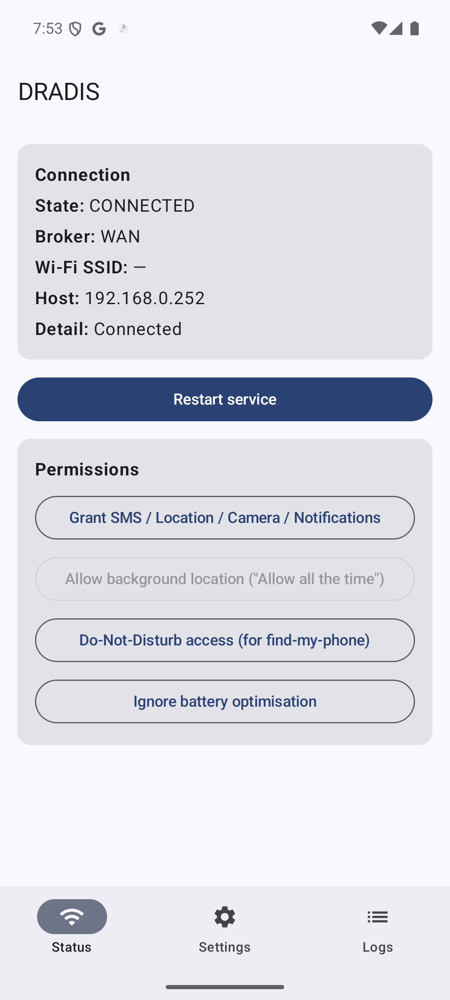
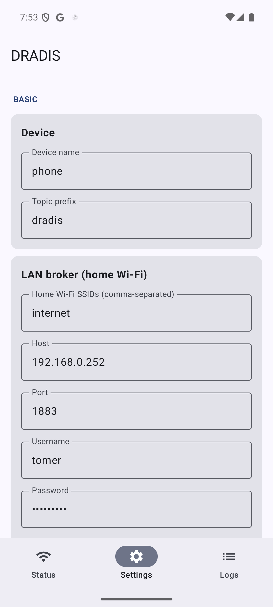
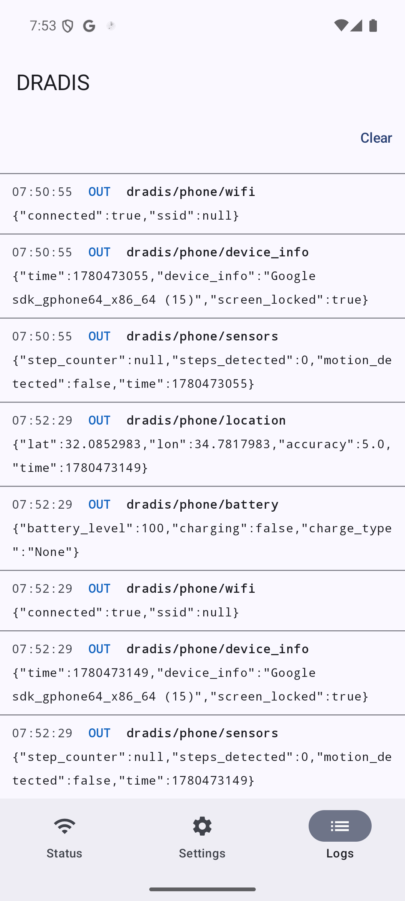
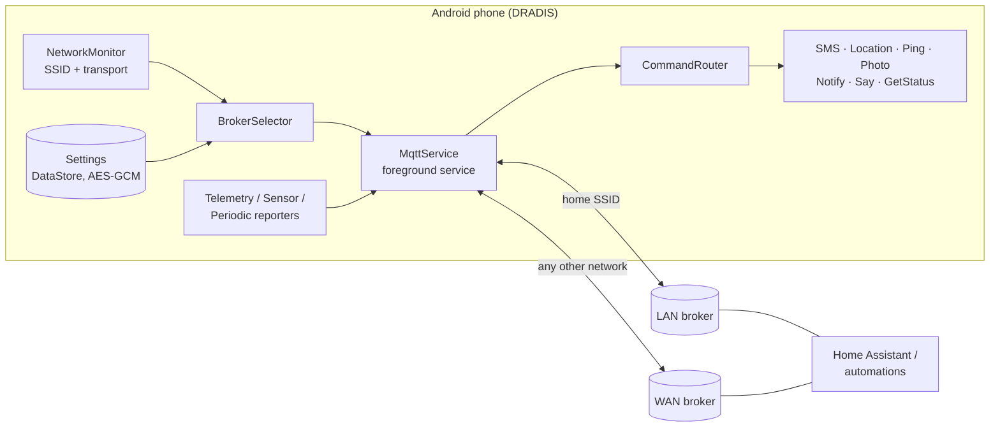

# DRADIS

[](https://github.com/t0mer/dradis/releases/latest)
[](LICENSE)

**DRADIS** turns an Android phone into an MQTT endpoint you can control remotely.
A foreground service holds a persistent MQTT connection, reacts to inbound
command topics (send SMS, get location, find‑my‑phone, take photo, push
notification, speak text), and publishes telemetry (battery, charging, Wi‑Fi,
sensors, location, online status).

It is a native replacement for the third‑party **Zanzito** app. The topic prefix
is configurable and defaults to `dradis`; set it to `zanzito` to stay
**wire‑compatible** with the legacy backend (Mosquitto + a Flask `smssender.py`
microservice publishing to `zanzito/<device>/sendsms/...`).

A defining feature: DRADIS **picks one of two brokers based on the Wi‑Fi network**
— a **LAN** broker when on a known home SSID, a **WAN** broker otherwise — and
reconnects automatically as the phone moves between networks.

> ⚠️ Personal, **sideloaded** app. `SEND_SMS`, background location and the camera
> are heavily restricted on Google Play, so this is **not** intended for Play
> distribution.

---

## Table of contents

- [Screenshots](#screenshots)
- [Features](#features)
- [How it works](#how-it-works)
- [Requirements](#requirements)
- [Installation](#installation)
- [Permissions](#permissions)
- [Settings reference](#settings-reference)
- [MQTT topic contract](#mqtt-topic-contract)
- [Home Assistant](#home-assistant)
- [Device & power notes](#device--power-notes)
- [Troubleshooting](#troubleshooting)
- [Security](#security)
- [Build & run](#build--run)
- [Tech stack](#tech-stack)
- [Contributing](#contributing)
- [License](#license)

---

## Screenshots

<!-- TODO: screenshot — these predate the About tab and the "Dradis" title; recapture -->

| Status | Settings | Logs |
|---|---|---|
|  |  |  |

- **Status**: live connection state (`CONNECTED` / `CONNECTING` / `DISCONNECTED` /
  `UNAUTHORIZED`), selected broker (LAN/WAN), current SSID / host, a
  start/restart‑service button, and one‑tap access to every permission DRADIS needs.
  A warning card appears when home SSIDs are configured but background location
  is not granted.
- **Settings**: grouped into **Basic · Outbound · Inbound · Integrations ·
  Behaviour**; device name, topic prefix, home SSIDs, both brokers
  (host / port / auth / TLS + CA certificate), update modes and interval, and
  each feature with its own options. Password fields are masked.
- **Logs**: a live, in‑app mirror of the most recent 200 inbound/outbound MQTT
  messages and service events, independent of `logcat`.
- **About** (no screenshot): version, release date, author, and links to the
  GitHub repository and the issue tracker.

---

## Features

| Feature | Description |
|---|---|
| **Dual MQTT brokers** | LAN broker on a known home SSID, WAN broker otherwise; auto‑switch + auto‑reconnect on network change. If only one broker is configured, it is used on every network. |
| **Send SMS** | JSON `{phone,text}`, or the legacy Zanzito topic‑path form; long messages are split into multipart SMS; result published to `sendsms/result`; optional notification after sending. |
| **Location** | On‑demand fix, on every (re)connect, and periodic publishing on the update interval; high‑accuracy toggle. |
| **Find my phone** | Loud, looping alarm + vibration that can bypass silent / Do‑Not‑Disturb; configurable duration and **ringtone**; remote stop. |
| **Battery & charging** | Level (0–100), charging flag, charge type (AC / USB / Wireless / None). Republished when the charger is connected or disconnected. |
| **Wi‑Fi** | Connection state + SSID. |
| **Sensors** | Step counter, step detector and significant‑motion. |
| **Take photo** | Headless capture from the front or rear camera, resized to max 1280 px, JPEG quality 70, published as base64; default camera setting. |
| **Push notification** | Show a notification in the device's notification shade from a remote message; optionally read it aloud via TTS. |
| **Text‑to‑speech** | Speak a remote message aloud (device default language). |
| **Telemetry** | Battery / Wi‑Fi / device‑info / sensors / location, each on its own topic. All five are sent on connect and on every heartbeat; a charger change sends battery, Wi‑Fi and device‑info; `getstatus` sends battery, Wi‑Fi, device‑info and sensors. |
| **Home Assistant** | MQTT auto‑discovery: appears as one device with a device_tracker, sensors/binary‑sensors and command buttons. |
| **Stay connected while asleep** | Optional Wi‑Fi lock + partial wake lock so the link survives screen‑off / device sleep. |
| **Autostart** | Starts the service after boot (when enabled). |
| **Encrypted settings** | Settings (incl. broker credentials and CA certificates) are encrypted at rest with AES‑256‑GCM using an Android Keystore key. |

---

## How it works


```mermaid
flowchart LR
    subgraph Phone["Android phone (DRADIS)"]
        NM[NetworkMonitor<br/>SSID + transport] --> BS[BrokerSelector]
        ST[(Settings<br/>DataStore, AES-GCM)] --> BS
        BS --> SVC[MqttService<br/>foreground service]
        SVC --> CR[CommandRouter]
        CR --> H[SMS · Location · Ping · Photo<br/>Notify · Say · GetStatus]
        TR[Telemetry / Sensor /<br/>Periodic reporters] --> SVC
    end
    SVC <-->|home SSID| LAN[(LAN broker)]
    SVC <-->|any other network| WAN[(WAN broker)]
    LAN --- HA[Home Assistant /<br/>automations]
    WAN --- HA
```

- A single **foreground service** (`MqttService`) owns the HiveMQ MQTT 3.1.1
  client for the whole app lifetime and shows a persistent notification. It is
  started with the `specialUse` foreground‑service type; camera and location run
  with while‑in‑use access when a command fires.
- **Broker selection (`BrokerSelector` + `NetworkMonitor`):** on every network
  change the current Wi‑Fi SSID is resolved; if it is in the configured **home
  SSID** list → **LAN** broker, otherwise → **WAN** broker. If only one of the two
  brokers is configured, it is used on every network. Switching networks tears
  down and reconnects to the right broker (debounced 2.5 s to ride out flaps). The
  client is only rebuilt when the selected broker actually changes.
- **SSID resolution:** the last‑known SSID is persisted and reused on a cold start,
  kept across short Wi‑Fi drops, and re‑read (up to 5 attempts, 1.5 s apart) at startup and
  whenever the app comes to the foreground (e.g. right after granting location).
- **Client ID:** a per‑install `dradis-<uuid>` is generated once and stored in
  settings; the broker session uses `dradis-<uuid>-lan` or `dradis-<uuid>-wan`. If
  the settings are cloned to another device (detected via `ANDROID_ID`), a new ID
  is generated so two phones never evict each other.
- **Reconnect:** HiveMQ auto‑reconnect with a tightened backoff (1 s → 20 s cap)
  and a 45 s keep‑alive, so transient drops recover in seconds and the
  connection survives cellular NAT timeouts. On an auth rejection
  (`NOT_AUTHORIZED` / bad username or password) the fast loop is cancelled and the
  service retries once a minute instead, so it doesn't feed broker lockouts.
- **LWT:** on connect it publishes `status=1` (retained); the Last‑Will sets
  `status=0` (retained) so subscribers learn when the phone drops off.
- **On every (re)connect:** re‑subscribes to the command topics, republishes
  `status` and `version`, republishes the Home Assistant discovery configs, and
  sends a full telemetry, sensors and location report.
- **Heartbeat:** when *periodic updates* are on, telemetry, sensors **and**
  location are published every *update interval* (default 90 s, minimum 15 s).
- Command handlers are isolated: a failure in one (e.g. camera) never drops the
  MQTT connection.

---

## Requirements

- An Android phone running **Android 8.0 (API 26)** or newer (target SDK 35 /
  Android 15). A SIM is needed for the SMS command.
- **Google Play services** (location uses the Fused Location Provider).
- An **MQTT broker** that speaks MQTT 3.1.1 (e.g. Mosquitto), optionally with TLS.
  A second, internet‑reachable broker (or the same broker on a public address) is
  needed if you want the phone reachable away from home.
- Optional: **Home Assistant** with the MQTT integration pointed at the same broker.

---

## Installation

1. Download the latest `dradis-<version>.apk` from the
   [Releases page](https://github.com/t0mer/dradis/releases/latest).
2. Open it on the phone and allow **Install unknown apps** for your browser / file
   manager when prompted.
3. Launch **Dradis**. It asks for notification permission (Android 13+) and starts
   the foreground service.
4. Open **Settings**, fill in the device name, the broker(s) and your home Wi‑Fi
   SSIDs, then tap **Save settings**.
5. On the **Status** tab, grant the permissions in this order:
   1. **Grant SMS / Location / Camera / Notifications** (the runtime group, which
      also includes physical activity for the step sensors).
   2. **Allow background location** → choose **"Allow all the time"**.
   3. **Do‑Not‑Disturb access** (lets find‑my‑phone ring through DND).
   4. **Ignore battery optimisation**.
6. Check that the Status tab shows `CONNECTED` and the expected broker (LAN/WAN).

Release APKs are signed with one release key, so newer releases install over older
ones in place.

---

## Permissions

| Permission | Why |
|---|---|
| `INTERNET`, `ACCESS_NETWORK_STATE`, `ACCESS_WIFI_STATE` | MQTT + network/SSID detection |
| `FOREGROUND_SERVICE` (+ `SPECIAL_USE`, `LOCATION`, `CAMERA`, `DATA_SYNC`) | persistent connection service (started as `specialUse`) |
| `SEND_SMS` | send SMS command |
| `ACCESS_FINE_LOCATION` / `ACCESS_COARSE_LOCATION` | location + reading the Wi‑Fi SSID |
| `ACCESS_BACKGROUND_LOCATION` | read SSID / location while backgrounded (**"Allow all the time"**) |
| `CAMERA` | take‑photo command |
| `POST_NOTIFICATIONS` | foreground + pushed notifications |
| `ACTIVITY_RECOGNITION` | step counter / detector |
| `ACCESS_NOTIFICATION_POLICY`, `MODIFY_AUDIO_SETTINGS`, `VIBRATE` | find‑my‑phone alarm through DND |
| `RECEIVE_BOOT_COMPLETED`, `WAKE_LOCK`, `REQUEST_IGNORE_BATTERY_OPTIMIZATIONS` | autostart + stay alive |

On first run, open the **Status** tab and grant the runtime group, then
**background location ("Allow all the time")**, **Do‑Not‑Disturb access**, and
**Ignore battery optimisation**.

---

## Settings reference

All settings are edited on the **Settings** tab and applied when you tap
**Save settings**.

### Basic

| Setting | Default | Description |
|---|---|---|
| Device name | `phone` | `<device>` segment of every topic. |
| Topic prefix | `dradis` | `<prefix>` segment of every topic; use `zanzito` for the legacy backend. |

**LAN broker (home Wi‑Fi)**

| Setting | Default | Description |
|---|---|---|
| Home Wi‑Fi SSIDs | *(empty)* | Comma‑separated SSIDs; on any of them the LAN broker is used. |
| Host / Port | *(empty)* / `1883` | Broker address. |
| Username / Password | *(empty)* | Optional; auth is sent only when a username is set. |
| Use TLS | off | Enables TLS. |
| CA certificate | none | PEM file picked from storage (shown when TLS is on). |

**WAN broker (mobile / away)**

| Setting | Default | Description |
|---|---|---|
| Host / Port | *(empty)* / `8883` | Broker address, reachable from the internet. |
| Username / Password | *(empty)* | Optional; auth is sent only when a username is set. |
| Use TLS | on | Enables TLS. |
| CA certificate | none | PEM file picked from storage (shown when TLS is on). |

> Toggling **Use TLS** swaps the port between `1883` (plain) and `8883` (TLS) when
> the port is still at the other default. For a self‑signed / private‑CA broker,
> **upload its CA certificate** (PEM) so the app can validate the connection; with
> no CA (or an unreadable one) the system trust store (public CAs) is used.

**Update modes**

| Setting | Default | Description |
|---|---|---|
| Publish periodically | on | Heartbeat: telemetry + sensors + location every interval. |
| Update interval (seconds) | `90` | Minimum 15. |

### Outbound

| Setting | Default | Description |
|---|---|---|
| Location: Enabled | on | Publish GPS location (on demand, on connect, periodically). |
| Location: High accuracy | on | High‑accuracy (GPS) fix; off = balanced power. |
| Telemetry: Enabled | on | Battery, Wi‑Fi and device info; also gates `getstatus`. |
| Sensors: Enabled | on | Step counter, step detector, significant motion. |
| Camera: Enabled | on | Capture photos on request. |
| Camera: Default camera: rear | on | Camera used when a request doesn't name one (off = front). |

### Inbound

| Setting | Default | Description |
|---|---|---|
| SMS: Enabled | on | Send SMS on request. |
| SMS: Notify when sent | off | Post a local notification after sending. |
| Notifications: Enabled | on | Show pushed notifications. |
| Notifications: Read aloud | off | Also speak them via TTS (needs Text‑to‑speech enabled). |
| Text‑to‑speech: Enabled | on | Speak text sent to `…/say`. |
| Alarm: Enabled | on | Sound the find‑my‑phone alarm on request. |
| Alarm: Alarm duration (seconds) | `3` | Used when a `ping` payload has no `seconds`; 1–600. |
| Alarm: Ringtone | default alarm | Picked from the system ringtone picker. |
| Alarm: Override silent / DND | on | Max the alarm stream and ring through Do‑Not‑Disturb. |

### Integrations

| Setting | Default | Description |
|---|---|---|
| Home Assistant: MQTT discovery | on | Publish retained discovery configs. |
| Home Assistant: Discovery prefix | `homeassistant` | HA discovery prefix. |

### Behaviour

| Setting | Default | Description |
|---|---|---|
| Autostart on boot | on | Start the service after boot. |
| Reconnect on network change | on | Debounce network changes (2.5 s) before re‑selecting the broker. When off, the broker is re‑selected immediately, without the debounce (reconnecting is not disabled). |
| Keep connected while asleep | on | Hold a Wi‑Fi lock + partial wake lock so the MQTT link survives device sleep (costs some battery). |

---

## MQTT topic contract

Topics are `<prefix>/<device>/<leaf>`, e.g. `dradis/phone/sendsms`. Both `prefix`
(default `dradis`) and `device` (default `phone`) are configurable. All
subscriptions and publishes use **QoS 1**; `status` and `version` are retained,
everything else DRADIS publishes is not (apart from Home Assistant discovery
configs).

**Commands are events, not state:** retained messages delivered on (re)subscribe
are **ignored**, and an empty payload on `ping` or `takephoto` is ignored too (it
is how tools such as MQTT Explorer clear a retained topic). Send `{}` to use
defaults.

### Inbound: commands the app subscribes to

| Purpose | Topic | Payload |
|---|---|---|
| Send SMS (preferred) | `<prefix>/<device>/sendsms` | `{"phone":"+972…","text":"hello"}` |
| Send SMS (legacy) | `<prefix>/<device>/sendsms/<phone>` | raw string = message text |
| Get location now | `<prefix>/<device>/getlocation` | any (e.g. empty / `{}`) |
| Find phone | `<prefix>/<device>/ping` | `{"seconds":N}`; `{}` or non‑JSON → configured duration (default 3 s); `0` or negative stops; max 600 s |
| Take photo | `<prefix>/<device>/takephoto` | `{"camera":"front"\|"rear"}`; `{}` → default camera |
| Push notification | `<prefix>/<device>/notify` | `{"title":"…","text":"…","id"?:N}` or raw text (title defaults to `Dradis`; reusing an `id` replaces that notification) |
| Text‑to‑speech | `<prefix>/<device>/say` | `{"text":"…"}` or raw text |
| Force telemetry | `<prefix>/<device>/getstatus` | any (e.g. empty); publishes `battery`, `wifi`, `device_info` and `sensors` (sensors only if Sensors is enabled) |

Each command is ignored (with a note in the in‑app log) when its feature is
disabled in Settings.

### Outbound: what the app publishes

| Purpose | Topic | Payload | Retained |
|---|---|---|---|
| Online status | `<prefix>/<device>/status` | `1` online / `0` LWT offline | ✅ |
| App version | `<prefix>/<device>/version` | e.g. `2026.6.12` | ✅ |
| Device info | `<prefix>/<device>/device_info` | `{time, device_info, screen_locked}` | — |
| Battery | `<prefix>/<device>/battery` | `{battery_level, charging, charge_type}` | — |
| Wi‑Fi | `<prefix>/<device>/wifi` | `{connected, ssid}` | — |
| Sensors | `<prefix>/<device>/sensors` | `{step_counter, steps_detected, motion_detected, time}` | — |
| Location | `<prefix>/<device>/location` | `{latitude, longitude, gps_accuracy, time}` | — |
| Photo | `<prefix>/<device>/photo` | `{camera, time, jpeg_b64}` | — |
| SMS result | `<prefix>/<device>/sendsms/result` | `{phone, ok, error?}` | — |

All `time` fields are Unix epoch **seconds**.

### Payload examples

```jsonc
// battery
{ "battery_level": 76, "charging": true, "charge_type": "USB" }   // AC|USB|Wireless|None
// wifi          (ssid is null off Wi-Fi or when unreadable)
{ "connected": true, "ssid": "Home-WiFi" }
// sensors       (step_counter null if the device has no step hardware or ACTIVITY_RECOGNITION is denied;
//                steps_detected counts since the service started; motion_detected resets after each report)
{ "step_counter": 18342, "steps_detected": 12, "motion_detected": false, "time": 1780473149 }
// location  (Home Assistant device_tracker GPS attribute names)
{ "latitude": 32.0853, "longitude": 34.7818, "gps_accuracy": 5.0, "time": 1780473149 }
// device_info
{ "time": 1780473149, "device_info": "samsung SM-S926B (15)", "screen_locked": true }
// photo
{ "camera": "rear", "time": 1780473149, "jpeg_b64": "/9j/4AAQ…" }
// sendsms/result
{ "phone": "+972501234567", "ok": false, "error": "SEND_SMS permission not granted" }
```

### Command examples

```bash
DEV=dradis/phone        # <prefix>/<device>
mosquitto_pub -h <broker> -t $DEV/sendsms     -m '{"phone":"+972501234567","text":"hello"}'
mosquitto_pub -h <broker> -t $DEV/getlocation -m ''
mosquitto_pub -h <broker> -t $DEV/ping        -m '{"seconds":15}'      # 0 = stop
mosquitto_pub -h <broker> -t $DEV/takephoto   -m '{"camera":"rear"}'
mosquitto_pub -h <broker> -t $DEV/notify      -m '{"title":"Hi","text":"Dinner is ready"}'
mosquitto_pub -h <broker> -t $DEV/say         -m '{"text":"Dinner is ready"}'
mosquitto_pub -h <broker> -t $DEV/getstatus   -m ''

# Watch everything the phone publishes
mosquitto_sub -h <broker> -t "$DEV/#" -v
```

Do not publish commands with the retain flag (`-r`): retained commands are ignored.

---

## Home Assistant

DRADIS supports **MQTT auto‑discovery**. With **Settings → Home Assistant → MQTT
discovery** enabled (default), it publishes retained config topics under the
discovery prefix (default `homeassistant`) on every connect and settings save, so
HA auto‑creates a single **DRADIS &lt;device&gt;** device with:

| Entity | Type | Source |
|---|---|---|
| Location | `device_tracker` (GPS) | `…/location` (`latitude`/`longitude`/`gps_accuracy`) |
| Battery | `sensor` (battery %, measurement) | `…/battery` |
| Charging | `binary_sensor` (battery_charging) | `…/battery` |
| Charge type | `sensor` | `…/battery` |
| Wi‑Fi | `binary_sensor` (connectivity) | `…/wifi` |
| SSID | `sensor` | `…/wifi` |
| Steps | `sensor` (total_increasing) | `…/sensors` |
| Motion | `binary_sensor` (motion) | `…/sensors` |
| Find phone | `button` | `…/ping` with `{"seconds":30}` |
| Take photo | `button` | `…/takephoto` with `{"camera":"rear"}` |
| Update location | `button` | `…/getlocation` |
| Refresh status | `button` | `…/getstatus` |

Config topics follow `<discovery prefix>/<component>/dradis_<device>/<object>/config`.
Entity availability follows the retained `…/status` topic (LWT), so the device
shows **unavailable** when the phone drops off. Requires Home Assistant's
**MQTT integration** pointed at the same broker. Disabling the toggle clears the
discovery configs (empty retained payloads).

---

## Device & power notes

- **Wi‑Fi SSID / LAN↔WAN switch needs background location.** Android redacts the
  SSID for a background reader unless **"Allow all the time"** is granted (plus
  location services on). Without it the SSID reads as unknown → DRADIS picks the
  WAN broker.
- **WAN broker must be reachable off‑LAN.** A private address like `192.168.0.252`
  only works on the home network. For the WAN broker, use a public IP / DDNS
  hostname (with router port forwarding) or a cloud broker, ideally over **TLS**.
- **Keep it connected (especially Samsung / One UI):** keep **Keep connected while
  asleep** on, grant **Ignore battery optimisation**, set the app to
  **Unrestricted** battery usage, and add it to **"Never sleeping apps"** (and not
  "Deep sleeping apps"). In deep Doze the OS can still drop the socket; DRADIS
  reconnects within ~20 s once it can.
- **MIUI / Xiaomi:** also enable **Autostart**, because `RECEIVE_BOOT_COMPLETED`
  alone is not honoured there.

---

## Troubleshooting

| Symptom | Likely cause / fix |
|---|---|
| Status `DISCONNECTED` with detail *Broker not configured* | Neither broker has a host set. Fill in at least one broker and save. |
| Status `UNAUTHORIZED` / notification *Not authorized — check broker credentials* | The broker rejected the username/password (or temporarily locked the client out). DRADIS retries once a minute; fix the credentials and save to reconnect immediately. |
| Always on the WAN broker at home | The SSID can't be read: grant **"Allow all the time"** location, turn location services on, and check the SSID spelling in **Home Wi‑Fi SSIDs**. |
| Phone goes offline when the screen is off | Enable **Keep connected while asleep** and apply the battery settings in [Device & power notes](#device--power-notes). |
| Find‑my‑phone is silent in DND | Grant **Do‑Not‑Disturb access** and keep **Override silent / DND** on. |
| `sendsms/result` has `"error": "SEND_SMS permission not granted"` or `"missing phone or text"` | Grant the SMS permission, or fix the payload. |
| `step_counter` is `null` | The device has no step sensor or **Physical activity** permission is denied. |
| A command does nothing | Check the feature is enabled in Settings, that it wasn't published retained, and look at the **Logs** tab for the reason. |
| "App not installed" when updating | The installed APK was signed with a different key (e.g. a local debug build). Uninstall first; this wipes the settings. |

---

## Security

- Prefer **TLS (8883)** for any broker reachable off your LAN. Without it, SMS
  text, location and credentials travel in cleartext.
- Anyone who can publish to `<prefix>/<device>/…` can send SMS, trigger the camera
  and read the phone's location. Use **broker authentication + per‑topic ACLs** and
  a non‑guessable device name.
- Settings, including broker credentials and CA certificates, are stored in
  DataStore **encrypted with AES‑256‑GCM** using a non‑exportable Android Keystore
  key. Password fields are masked in the UI. App backup is disabled
  (`allowBackup="false"`).
- The in‑app log masks phone‑number‑like digit runs in inbound topics/payloads and
  truncates inbound payloads to 300 characters.
- Keystores and `keystore.properties` are git‑ignored.

---

## Build & run

Requires **JDK 17** and the Android SDK (platform 35, build‑tools 35.x). The
Gradle wrapper pins **Gradle 8.13**, so no system Gradle is needed. On Linux/macOS
use `./gradlew` instead of `.\gradlew.bat`.

```powershell
# Debug APK  ->  app\build\outputs\apk\debug\app-debug.apk
.\gradlew.bat assembleDebug

# Install + launch on a connected device/emulator
.\gradlew.bat installDebug
adb shell am start -n dev.tomerklein.dradis/.MainActivity

# Static analysis
.\gradlew.bat lintDebug
```

### Signed release

Create a keystore (kept out of git) and a git‑ignored `keystore.properties` at the
repo root:

```properties
storeFile=C:/Users/you/keystores/dradis.jks
storePassword=…
keyAlias=dradis
keyPassword=…
```

Alternatively, set the environment variables `DRADIS_KEYSTORE_FILE`,
`DRADIS_KEYSTORE_PASSWORD`, `DRADIS_KEY_ALIAS` and `DRADIS_KEY_PASSWORD`; they
take precedence over `keystore.properties`.

```powershell
.\gradlew.bat assembleRelease -PdradisVersion=2026.6.9
# -> app\build\outputs\apk\release\app-release.apk
```

Release builds are minified with R8. When a release key is configured, **debug
builds are signed with it too**, so debug and release APKs can update each other in
place. Without it, debug builds use the default per‑machine debug key.

### Versioning & CI release

Versions are date‑based **`YYYY.M.PATCH`** (e.g. `2026.6.9`) computed by
`scripts/next-version.sh`; `versionCode` is derived from it (e.g. `260609`). Local
builds without `-PdradisVersion` are versioned `dev` with `versionCode` 1, which
can't be installed over a dated release. The `Release` GitHub Action
(**Actions → Release**, `workflow_dispatch`, optional `version` input) builds the
**signed** APK in CI (keystore from repo secrets), tags the version, and publishes
a GitHub Release with `dradis-<version>.apk` attached.

Required repo secrets: `KEYSTORE_BASE64`, `KEYSTORE_PASSWORD`, `KEY_ALIAS`,
`KEY_PASSWORD`.

Dependabot checks Gradle dependencies and GitHub Actions weekly.

---

## Tech stack

Kotlin · Jetpack Compose + Material 3 · HiveMQ MQTT Client (3.1.1) · CameraX ·
FusedLocationProvider · Jetpack DataStore + Android Keystore · kotlinx.serialization ·
foreground service. minSdk 26, target/compileSdk 35, JDK 17, AGP 8.7.3 /
Gradle 8.13.

### Project layout

```
app/src/main/java/dev/tomerklein/dradis/
  MainActivity.kt            # Compose host (Status / Settings / Logs / About)
  DradisApp.kt, ServiceLocator.kt  # app entry point + manual DI
  mqtt/                      # MqttService, client wrapper, BrokerSelector, Topics, TLS,
                             # HA discovery, wake/Wi-Fi locks
  commands/                  # SMS, location, ping, photo, notify, say, getstatus handlers + router
  telemetry/                 # battery+wifi+device_info, sensors, periodic reporter, location
  net/NetworkMonitor.kt      # connectivity + SSID
  settings/                  # DataStore-backed, encrypted settings + client ID
  log/MqttLog.kt             # in-app log ring buffer
  ui/                        # Compose screens
  boot/BootReceiver.kt       # autostart
```

---

## Contributing

Bug reports and pull requests are welcome. Open an issue at
[github.com/t0mer/dradis/issues](https://github.com/t0mer/dradis/issues) (the
**About** tab links there too). For code changes, keep every topic string in
`mqtt/Topics.kt`, and run `lintDebug` and a release build (`assembleRelease`) before
opening a PR.

---

## License

Licensed under the [Apache License 2.0](LICENSE).
